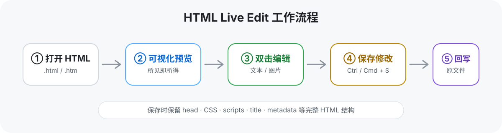

<p align="center">
  
</p>

<h1 align="center">HTML Live Edit</h1>

<p align="center">
  在 VS Code、Trae、Cursor 中直接可视化编辑 HTML：<strong>看到什么，就改什么。</strong>
</p>

<p align="center">
  
  
  
</p>

---

**HTML Live Edit** 是一个面向 VS Code 及兼容编辑器的 HTML 所见即所得（WYSIWYG）插件。  
无需反复在源码和浏览器之间切换，直接在渲染后的页面上双击文字或图片即可修改，并将结果保存回原始 HTML 文件。



## 主要功能

- 🖱️ **双击编辑文本**：直接在渲染页面中原位修改标题、段落、表格、列表等内容。
- 🖼️ **双击替换图片**：双击图片，通过文件选择器快速替换。
- 👀 **实时可视化预览**：编辑时直接看到页面实际呈现效果。
- 📝 **源码视图**：可在可视化编辑和原始 HTML 源码之间切换。
- ↩️ **撤销 / 重做**：支持 Ctrl+Z / Ctrl+Y。
- 🔍 **页面缩放**：支持放大、缩小和重置缩放。
- 💾 **完整保存 HTML**：回写内容时保留 `head`、样式、脚本、标题、链接、元数据等结构。
- 🏷️ **元素信息提示**：编辑模式下悬停可查看标签名、类名和字符数。
- 📊 **编辑计数**：显示当前已经完成的修改次数。
- 🧩 **兼容 HTML 片段**：支持完整 HTML 文档、隐式 `head` 文档以及不带 `html/body` 外壳的片段。

## 适合什么场景

特别适合需要频繁调整 HTML 内容、但不想一直手改标签的场景，例如：

- 静态网页和落地页内容微调
- HTML 报告、仪表盘和数据展示页面
- AI 生成 HTML 后的快速人工修订
- 表格、说明文字、图注等内容维护
- 在 Trae / Cursor 中边开发边进行可视化修改

## 安装

### 方法一：安装 VSIX

1. 从 [Releases](../../releases) 下载最新的 `.vsix` 文件。
2. 在 VS Code / Trae / Cursor 中打开命令面板：
   - Windows / Linux：`Ctrl+Shift+P`
   - macOS：`Cmd+Shift+P`
3. 执行 **Install from VSIX**。
4. 选择下载好的 `.vsix` 文件完成安装。

### 方法二：从源码构建

```bash
git clone https://github.com/JunbiaoXue/html-live-edit.git
cd html-live-edit
npm install
npm run compile
npx vsce package
```

## 使用方法

1. 打开一个 `.html` 或 `.htm` 文件。
2. 使用 **HTML Visual Editor** 打开：
   - 右键文件 / 编辑器，选择 **Open With...**
   - 或执行命令 **Open HTML Visual Editor**
   - 也可以使用 `Ctrl+Shift+V`，macOS 使用 `Cmd+Shift+V`
3. 点击工具栏中的 **✏️ Edit**，进入编辑模式。
4. 双击文本进行原位编辑；双击图片可替换图片。
5. 需要直接改代码时，切换到 **Source** 源码视图。
6. 完成后点击 **💾 Save** 或使用保存快捷键。

## 快捷键

| 快捷键 | 功能 |
|---|---|
| `Ctrl+E` | 切换编辑模式 |
| `Ctrl+U` | 切换源码视图 |
| `Ctrl+S` | 保存 |
| `Ctrl+Z` | 撤销 |
| `Ctrl+Y` | 重做 |
| `Ctrl++` | 放大 |
| `Ctrl+-` | 缩小 |
| `Ctrl+0` | 重置缩放 |
| `Ctrl+Shift+V` / `Cmd+Shift+V` | 使用 HTML Visual Editor 打开当前 HTML |

## 支持编辑的元素

| 类型 | 元素 / 选择器 |
|---|---|
| 标题 | `h1`–`h6` |
| 段落 | `p` |
| 列表 | `li`、`dt`、`dd`、`summary` |
| 表格 | `td`、`th`、`caption` |
| 行内文本 | `span`、`strong`、`em`、`b`、`i`、`u`、`mark`、`small`、`sub`、`sup` |
| 链接 / 标注 | `a`、`abbr`、`time` |
| 提示块 | `.note`、`.warn` |
| 报告组件 | `.kpi-label`、`.kpi-value`、`.subtitle`、`.figure-caption`、`.insight-box strong`、`.highlight` |
| 图片 | `img`，双击替换 |

## 当前版本：v1.2.2

### v1.2.2

- `.note`、`.warn` 等提示容器可作为完整内容块编辑，包括加粗标签及其后的正文。

### v1.2.1

- 支持显式 `<head>...</head>`、HTML5 隐式 head 以及 HTML 片段。
- 对省略 `<head>` 的浏览器有效 HTML，尽可能保留元数据、样式、脚本、标题、链接和基础 URL。

### v1.1.0

- 新增源码视图。
- 新增撤销 / 重做。
- 新增缩放控制。
- 新增图片替换。
- 新增元素悬停信息提示。
- 改进保存逻辑，保留完整 HTML 结构。
- 扩展报告类组件的可编辑元素范围。
- 改进 base64 图片的 CSP 配置。

## 开发

环境要求：

- VS Code 1.74+
- Node.js / npm
- TypeScript

常用命令：

```bash
# 安装依赖
npm install

# 编译
npm run compile

# 监听 TypeScript 变化
npm run watch

# 打包 VSIX
npm run package
```

## 项目结构

```text
html-live-edit/
├── media/                  # 图标与 README 图片
├── src/
│   ├── extension.ts        # 插件入口
│   └── htmlEditorProvider.ts
├── package.json            # VS Code 扩展配置
├── tsconfig.json
└── README.md
```

## License

本项目采用 [MIT License](LICENSE)。

---

如果这个插件对你有帮助，可以给项目点一个 ⭐。
